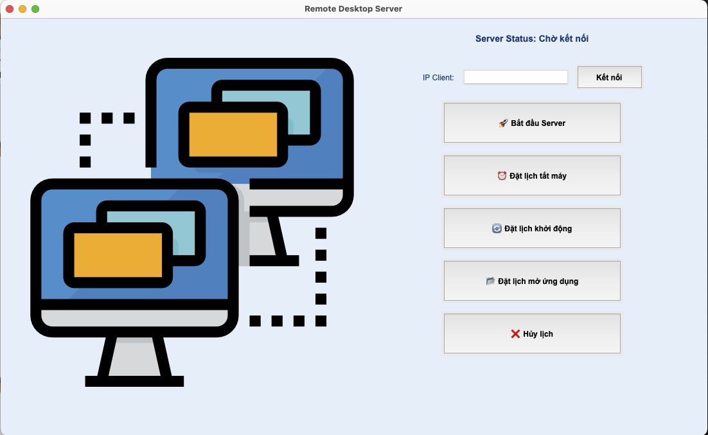
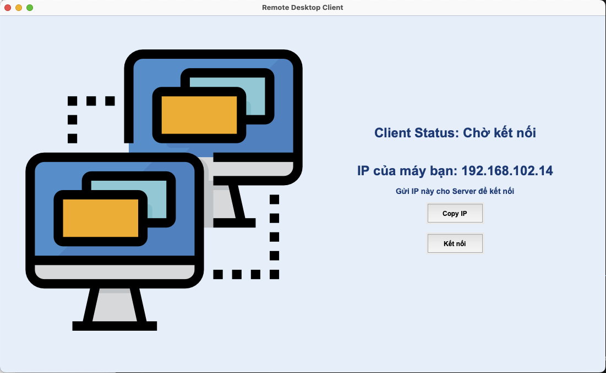

<h2 align="center">
    <a href="https://dainam.edu.vn/vi/khoa-cong-nghe-thong-tin">
        🎓 Faculty of Information Technology (DaiNam University)
    </a>
</h2>

<h2 align="center">
    Ứng dụng Remote Desktop Control
</h2>

<div align="center">
    <p align="center">
        
        
        
    </p>

[](https://www.facebook.com/DNUAIoTLab)
[](https://dainam.edu.vn/vi/khoa-cong-nghe-thong-tin)
[](https://dainam.edu.vn)

</div>

## 1. Giới thiệu hệ thống

Hệ thống **Remote Desktop Control** được phát triển theo mô hình **Client-Server**, cho phép người dùng **điều khiển máy tính từ xa** một cách dễ dàng.  

👉 **Chức năng chính**:
- Kết nối **Server ↔ Client** qua **Socket TCP**.
- Đặt lịch **tắt máy, khởi động lại, mở ứng dụng** từ xa.
- **Hủy lịch** các tác vụ đã đặt.
- Chụp ảnh màn hình, truyền dữ liệu và stream màn hình từ Client về Server.
- Giao diện trực quan, dễ sử dụng với **Tkinter GUI**.

---

## 🔧 2. Công nghệ & Ngôn ngữ sử dụng

[](https://www.python.org/)
[](https://docs.python.org/3/library/tkinter.html)
[](https://docs.python.org/3/library/socket.html)

**Chi tiết công nghệ:**
- **Python 3.8+**: Ngôn ngữ lập trình chính.
- **Tkinter**: Xây dựng giao diện người dùng.
- **Socket Programming**: Kết nối Client-Server.
- **MSS, PyAutoGUI**: Chụp ảnh/stream màn hình.
- **APScheduler**: Lập lịch các tác vụ từ xa.

---

## 🚀 3. Một số hình ảnh

### Giao diện Server


### Giao diện Client


---

## 📝 4. Các bước cài đặt

### Yêu cầu hệ thống:
- **Python 3.8+**
- Windows / Linux
- Thư viện Python cần thiết

### Cài đặt thư viện:
```bash
pip install pillow mss pyautogui apscheduler pyperclip
```

> ⚠️ Với Linux, cần cài thêm Tkinter:
> ```bash
> sudo apt-get install python3-tk
> ```

### Chạy chương trình:

**1. Khởi động Server**
```bash
python server_gui.py
```

**2. Khởi động Client**
```bash
python client_gui.py
```

**3. Kết nối & Sử dụng**
- Chạy **Server** trước → nhập IP của Client.  
- Client hiển thị địa chỉ IP của mình để gửi cho Server.  
- Khi kết nối thành công, có thể sử dụng các chức năng:  
  - Đặt lịch tắt máy/khởi động lại/mở ứng dụng.  
  - Hủy lịch tác vụ.  
  - Chụp ảnh màn hình/stream màn hình.  

---

## ✉️ 5. Liên hệ

**Tác giả**: Nguyễn Hải Phong  

📧 **Email**: phongankhoai3@gmail.com

🏫 **Trường**: Đại học Đại Nam - Khoa Công nghệ Thông tin  

---

## 📄 6. License

Dự án dành cho mục đích **học tập & nghiên cứu**.  
